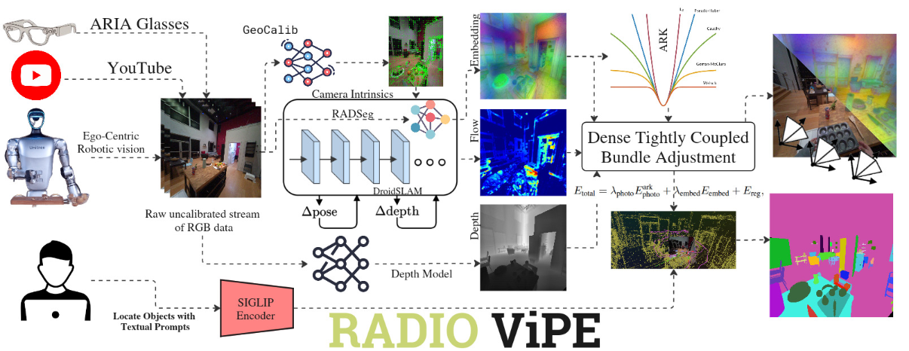

# RADIO-ViPE: Online Tightly Coupled Multi-Modal Fusion for Open-Vocabulary Semantic SLAM in Dynamic Environments

> **BE2R Lab** — Biomechatronics and Energy-Efficient Robotics Laboratory, ITMO University

🌐 **Project Page**: [be2rlab.github.io/radio_vipe](https://be2rlab.github.io/radio_vipe/) &nbsp;|&nbsp; 📄 **Paper**: https://arxiv.org/pdf/2604.26067

---



## Abstract

We present **RADIO-ViPE** (**R**educe **A**ll **D**omains **I**nto **O**ne — **Vi**deo **P**ose **E**ngine), an online semantic SLAM system that enables geometry-aware open-vocabulary grounding, associating arbitrary natural language queries with localized 3D regions and objects in dynamic environments.

Unlike existing approaches that require calibrated, posed RGB-D input, RADIO-ViPE operates directly on raw monocular RGB video streams, requiring no prior camera intrinsics, depth sensors, or pose initialization. The system tightly couples multi-modal embeddings — spanning vision and language — derived from agglomerative foundation models (e.g., RADIO) with geometric scene information. This vision-language-geometric fusion is optimized within adaptive robust kernels, designed to handle both actively moving objects and agent-displaced scene elements (e.g., furniture rearranged during ego-centric sessions).

Experiments demonstrate that RADIO-ViPE achieves state-of-the-art results on the dynamic TUM-RGBD benchmark while maintaining competitive performance against offline open-vocabulary methods that rely on calibrated data and static scene assumptions. RADIO-ViPE bridges a critical gap in real-world deployment, enabling robust open-vocabulary semantic grounding for autonomous robotics, AR/VR applications, and unconstrained in-the-wild video streams.


---

## Installation

### Docker

```bash
# Build the Docker image
make build

# Run the Docker image
make DATA_DIR={YOUR_DATA_DIR} run

# Inside the container, install the package
pip install --no-build-isolation -e .
```

---

## Usage

```bash
# Run the full pipeline
python run.py pipeline=default streams=raw_mp4_stream streams.base_path=YOUR_VIDEO_OR_DIR_PATH

# Run the pose-only pipeline (without depth estimation)
python run.py pipeline=default streams=raw_mp4_stream streams.base_path=YOUR_VIDEO_OR_DIR_PATH pipeline.post.depth_align_model=null
```

---

## Evaluation

### Semantic Segmentation evaluation

Semantic segmentation evaluation uses code borrowed from the [RayFronts](https://github.com/RayFronts/RayFronts) repository.

Run evaluation with one of the prepared configs:

```bash
python scripts/semseg_eval.py --config-name semseg_configs/replica_kmvipe
```

Expected outputs are saved under `eval_out/<experiment>/<DatasetName>/<scene>/`.

### RMSE evaluation

RMSE evaluation is performed using the shell scripts provided in `scripts/`, for example:

```bash
scripts/slam_evaluation_replica.sh
```

These scripts run the SLAM pipeline on the corresponding dataset and compute RMSE metrics for the generated trajectories.

---

## Acknowledgments

RADIO-ViPE builds upon many outstanding open-source research projects and codebases, including (non-exhaustive):

| Project | Reference |
|---|---|
| RAD-SEG | [arXiv:2511.19704](https://arxiv.org/abs/2511.19704) |
| KM-ViPE | [arXiv:2512.01889](https://arxiv.org/abs/2512.01889) |
| RayFronts | [arXiv:2504.06994](https://arxiv.org/abs/2504.06994) |
| ViPE | [GitHub](https://github.com/nv-tlabs/vipe?tab=readme-ov-file) |
| RADIO | [arXiv:2601.17237](https://arxiv.org/abs/2601.17237) |
| DINOv3 | [GitHub](https://github.com/facebookresearch/dinov3) |
| Talk2DINO | [GitHub](https://github.com/lorebianchi98/Talk2DINO) |
| RVWO | [GitHub](https://github.com/be2rlab/rvwo) |
| UniDepth | [GitHub](https://github.com/lpiccinelli-eth/UniDepth) |

---

## License

This project will download and install additional third-party **models and software**. Note that these are not distributed by NVIDIA — please review their respective license terms before use.

This source code is released under the [Apache 2.0 License](https://www.apache.org/licenses/LICENSE-2.0).
